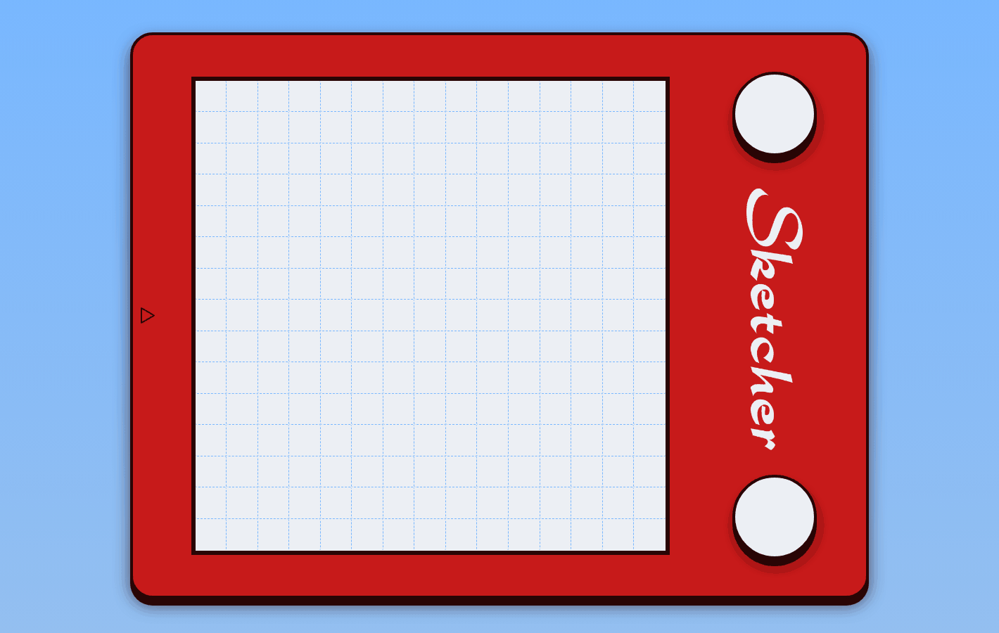

# Sketcher

This is 'Sketcher', an Etch-A-Sketch inspired browser drawing application, which is a project assignment that's part of The Odin Project (see: [Project Page](https://www.theodinproject.com/lessons/foundations-etch-a-sketch)).  

Click [here](https://ajvw2.github.io/odin-etch-a-sketch/) for a live demo.  

## Languages

- HTML
- CSS
- JavaScript

## Project Description

#### Features

- Sketcher drawing pad
    - Collapsible menu
    - Resizeable pixel grid (4x4 to 64x64) with grid toggler
    - Default pen tool with color selector
    - 'Rainbow mode', where a random color is selected each time a pixel is colored.
    - Fill tool (can also be used in combination with rainbow mode)
    - Eraser tool
    - Lighten / darken tools (to set brightness of pixels)
        - These reset only when using the eraser or the 'Clear Grid' button, so you can (for example) use different fills on the patterns you create with this
    - Sketch downloadable as PNG file
- Fully responsive UI
- Touch screen compatibility

#### Commentary

For this project, I used what I learned from my [Rock, Paper, Scissors](https://github.com/ajvw2/odin-rock-paper-scissors) application regarding responsive UI's. For this UI, getting it to act the way I wanted to for most screen sizes was significantly more challenging. I spent hours trying to make a responsive square pixel grid, but for some reason it is unreasonably difficult to make a perfectly resizeable square in CSS. I had to resort to the more time- and space-consuming approach of adding a lot of @media(max-width: ..px) declaration blocks to the CSS file. On top of that, it proved necessary to add some JavaScript to handle the resizing.  

I never made a collapsible menu before. This is something I decided to add later on in the development (it makes usage on smaller screens way more pleasant), and fortunately it wasn't as much of a hassle as I anticipated it to be. I'm happy with the result  

Developing the different drawing tools/methods was relatively straightforward. I enjoyed getting the recursive flood fill algorithm to work. Objectively, it's not particularly complicated, but getting all the base cases just right took some puzzling around for a noob like myself.  

Another fun little task was the implementation of downloadable PNG's. Converting the pixel grid to an (invisible) HTML canvas element, translating the color + brightness settings to a new RGB color - all that took some figuring-out. And it works!  

#### TODO

- Improve responsiveness somewhere down the line
    - Get rid of some 'clunkiness', especially on mobile screens

- Improve performance
    - The application can run a bit slowly for larger grid sizes, especially when grid lines are shown

- Fix visual UI bugs
    - Grid size not shown on slider thumb in Safari, seems to be layered behind the thumb

#### Creator

My Github profile: [ajvw2](https://github.com/ajvw2)